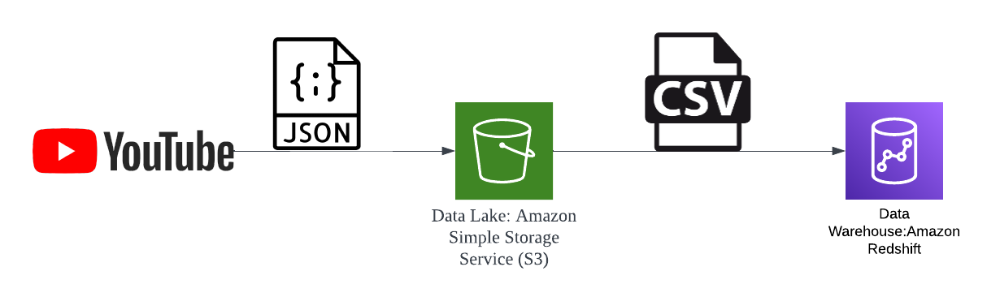
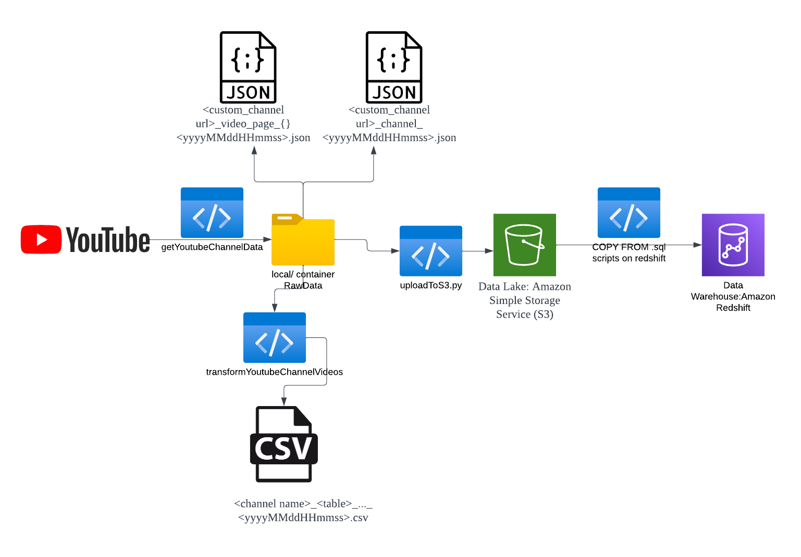
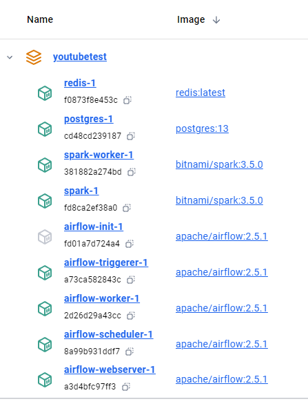

# Data Flow
## Diagram of AWS resources used


## Flow of Data 



# Setup
## .env file
Set up environment file with the following variables:  
```.env
youtube_api_key =   
s3_access_key =   
s3_secret_access_key =   
s3_bucket_name =   
```


## Set up bucket in S3
1. Create a bucket in S3
2. In Permissions>Bucket Policy>Edit Bucket Policy,   
    Go to Policy Generator and add your created user's ARN  
```json
{
    "Version": "2012-10-17",
    "Id": "Policy1725034783195",
    "Statement": [
        {
            "Sid": "Stmt1725034778821",
            "Effect": "Allow",
            "Principal": {
                "AWS": "<your user arn"
            },
            "Action": "s3:*",
            "Resource": "<your s3 arn>"
        }
    ]
}
```
  
## Set up redshift serverless  

### Set up redshift permissions with S3  
1. Go to Redshift Serverless>name space>security and encryption  
2. Under permissions>Manage IAM roles, set "Create IAM role"  
3. Under Create default IAM role, specify "Any S3 bucket" or "Specific S3 buckets"  


## Permissions in AWS
1. Create a user in IAM
2. Assign this user the following AWS policies:
    1. AmazonS3FullAccess
    2. The IAM role created in <b>Set up redshift permissions with S3 </b>

## Obtain s3 access key, secret access key:
1. From AWS console, select IAM resource  
2. Under Access Management, select <code>Users</code> and create/select your user
3. Ensure your user has the permissions in the previous section
4. Under <code>Security Credentials</code>, Access Keys> Create access key
5. Copy and paste the secret to the <code>.env</code> file


## Set up Airflow Orchestrator (WIP)
1. Run <code>docker compose up -d</code>  
This will be the expected cotainers running:  
  
<b>Redis & Postgres</b>: Used by Airflow   
<b>Spark worker & spark</b>: The spark instance  

Check the spark worker is running at <code>localhost:9091</code>
# Manual ETL Flow
Run the scripts in src in the following order:
```python
1. getYoutubeChannelData.py  
2. transformYoutubeChannelVideos.py  
3. uploadToS3.py  
```

Next, In Redshift Serverless, run the following sql scripts under redshift_scripts:  
```
1. copy_channel_dim.sql  
2. copy_channel_fact.sql  
3. copy_video_dim.sql   
4. copy_video_fact.sql   
```
5. Once database is updated, run required sql scripts for answering user questions  

# References
youtube channel analytics extraction: https://github.com/JensBender/youtube-channel-analytics/tree/main  
Airflow orchestration: https://github.com/ABZ-Aaron/Reddit-API-Pipeline/blob/master/airflow/dags/elt_reddit_pipeline.py  
Redshift permissions: https://www.youtube.com/watch?v=0qCcxJlbPfg